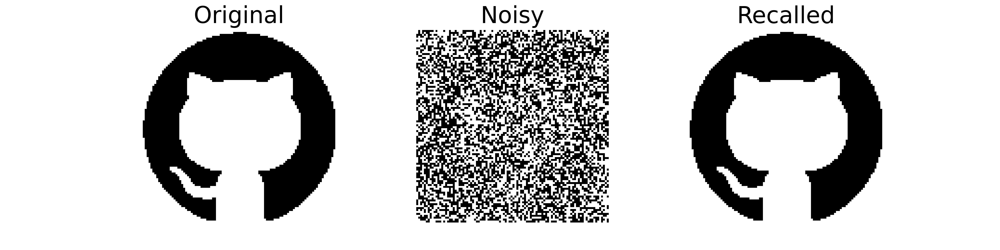
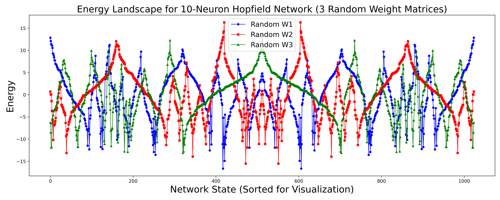
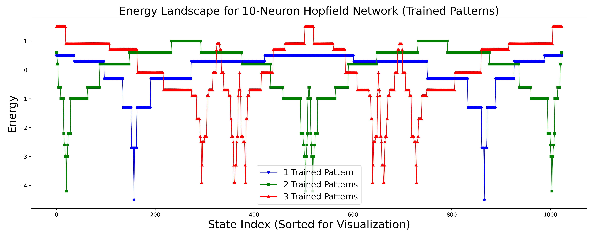
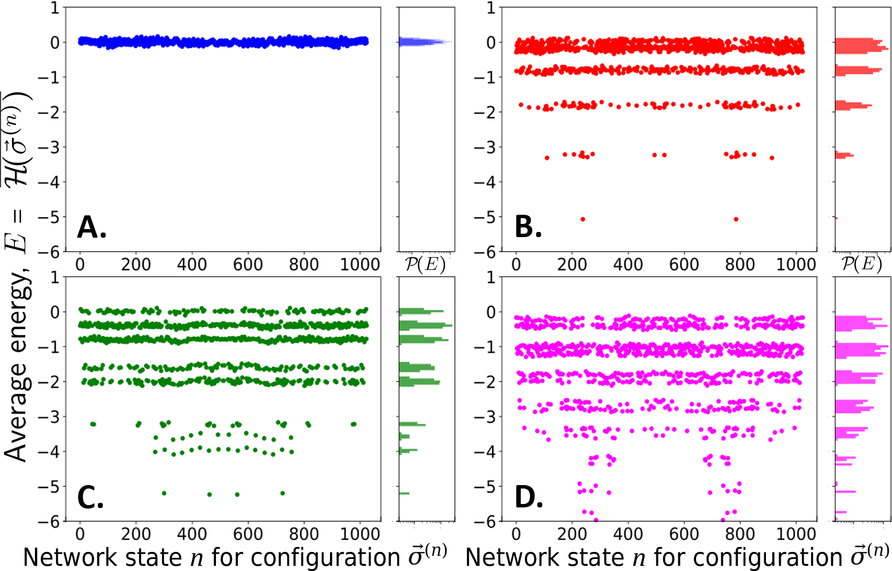

# Building a Hopfield Network From Scratch

## Memory, Learning, and Statistical Physics

[](https://www.python.org/)
[](https://arxiv.org/abs/2601.07635)
[](LICENSE)

A from-scratch NumPy implementation of the **Hopfield neural network**, built to explore associative memory, error correction, and energy landscapes from the point of view of statistical physics — spin glasses, mean-field ferromagnets, and Hebbian learning.

This repository is the companion code for the Scientific Initiation (Iniciação Científica) project *"Memória e Aprendizado: Inteligência Artificial do Ponto de Vista Físico"*, developed at the Departamento de Física, Universidade Federal de Santa Catarina (UFSC), and for the paper **["Learning About Learning: A Path from Spin Glasses to Artificial Intelligence"](https://arxiv.org/abs/2601.07635)**, accepted for publication in the *American Journal of Physics* (forthcoming, November 2026).

## Table of Contents

- [Overview](#overview)
- [Key Features](#key-features)
- [Theoretical Background](#theoretical-background)
- [Repository Structure](#repository-structure)
- [Installation](#installation)
- [Quick Start](#quick-start)
- [Results](#results)
- [Real-World Applications](#real-world-applications)
- [Limitations & Future Directions](#limitations--future-directions)
- [Citation](#citation)
- [Acknowledgments](#acknowledgments)
- [License](#license)

## Overview

In the early 1980s, John Hopfield showed that a network of binary, spin-like units connected by symmetric, Hebbian-trained synapses behaves as a **content-addressable memory**: give it a corrupted or partial pattern, and it relaxes — deterministically and provably — into the closest stored memory. The model was inspired directly by the physics of spin glasses, and its guarantee of convergence follows from treating the network's own connectivity as an energy function to be minimized.

This project builds that model from first principles, starting from the mean-field Ising ferromagnet and the Sherrington–Kirkpatrick spin-glass Hamiltonian, and using them to motivate every piece of the Hopfield network: the Hebbian weight rule, the energy function, the update dynamics, and the notion of an "attractor." The code is then used to numerically demonstrate:

- error correction and pattern completion from noisy or partial cues,
- guaranteed, monotonic convergence to energy minima under asynchronous dynamics,
- the emergence of spurious attractors ("hallucinations") once storage capacity is exceeded, and
- how the energy landscape itself morphs — from the rugged, glassy topology of random couplings to a small number of deep, engineered wells — once memories are encoded.

## Key Features

- **Hebbian learning from scratch** — weight matrix built via the outer-product (Hebb) rule, with zero self-connections.
- **Two retrieval dynamics** — synchronous (all neurons updated at once) and asynchronous / Monte Carlo (one randomly chosen neuron per step), with automatic convergence detection.
- **Noise injection & robustness testing** — corrupt any stored pattern by a controllable fraction and watch the network recover it.
- **Image-to-pattern pipeline** — a full preprocessing routine (`preprocessar_para_hopfield`) that turns an arbitrary logo/image into a clean, croppped, and centered bipolar (±1) pattern ready to be memorized.
- **Exhaustive energy-landscape analysis** — brute-force enumeration of all 2ᴺ microstates for small networks, with sorting, spurious-state identification, and landscape plotting.
- **Ensemble statistics** — energy averaged over hundreds to thousands of random interaction-matrix realizations, used to expose the storage-capacity limit and the onset of spurious minima.
- **Synaptic weight visualization** — heatmaps of the trained weight matrix, and 1D/2D visualizations of stored, corrupted, and recalled patterns.

## Theoretical Background

The project's starting point is the mean-field Ising ferromagnet, whose equilibrium magnetization solves

$$m = \tanh(\beta J m + \beta H),$$

with a ferromagnetic transition at $\beta_c J = 1$. Allowing the couplings $J_{ij}$ to be random and quenched instead of uniform gives the **Sherrington–Kirkpatrick spin-glass Hamiltonian**,

$$\mathcal{H}(\vec{\sigma}) = -\frac{1}{2}\sum_{i,j} \frac{J_{ij}}{N}\,\sigma_i \sigma_j - H\sum_i \sigma_i,$$

whose energy landscape is rugged, with many metastable minima rather than a single ordered state.

Hopfield's insight was to treat the couplings themselves as the object to be *designed*, so that a chosen set of patterns $\vec{\xi}^{(\mu)}$, $\mu = 1, \dots, P$, become the landscape's minima. This is achieved with the **Hebbian rule**,

$$W_{ij} = \frac{1}{N}\sum_{\mu=1}^{P} \xi_i^{(\mu)}\xi_j^{(\mu)}, \qquad W_{ii}=0,$$

which defines the network's energy function

$$\mathcal{H}(\vec{\sigma}) = -\frac{1}{2}\sum_{i,j} W_{ij}\,\sigma_i \sigma_j - \sum_i H_i \sigma_i.$$

Neurons update according to $\sigma_i(t+1) = \mathrm{sign}\left[\sum_j W_{ij}\sigma_j(t) + H_i\right]$. Under asynchronous updates, $\mathcal{H}$ acts as a **Lyapunov function**: it never increases, guaranteeing convergence to a fixed point. The **overlap** $M(\vec{\xi}^{(\mu)}, \vec{\sigma}) = \frac{1}{N}\vec{\xi}^{(\mu)}\cdot\vec{\sigma}$ plays the role of the order parameter (the network's analogue of magnetization), and its value tells us how close the current state is to a given memory. Because $\mathcal{H}$ is invariant under $\vec{\sigma}\to-\vec{\sigma}$, every memory also has a stable "anti-memory."

Storing too many patterns overloads the network: cross-talk between memories creates spurious local minima ("hallucinations") that do not correspond to any stored pattern. This happens once $P$ approaches the classical critical storage capacity, $P_c \approx 0.138\,N$.

## Repository Structure

```markdown
.
├── modules/
│   └── hopfield_network.py     # Core library: training, dynamics, energy, preprocessing
├── learning_about_learning.ipynb  # Main notebook — reproduces every result/figure below
├── dataset/                     # Source images used as memories (euler, github, playstation, tolkien, ufsc)
├── data/
│   ├── pre/                     # Preliminary ensemble-average runs
│   └── averages_trained_*.npz   # Ensemble-averaged energies (0, 1, 2, 3 stored memories) for the statistics section
├── figures/                     # All generated figures (energy landscapes, synapses, recall demos, statistics)
├── .gitignore
└── LICENSE
```

## Installation

```bash
git clone https://github.com/d-domeniconi/hopfield_network.git
cd hopfield_network
pip install numpy matplotlib opencv-python scipy
```

The code was developed and tested with **Python 3.12**. To run the full notebook (recommended — it reproduces every figure in this README and in the accompanying paper):

```bash
jupyter notebook learning_about_learning.ipynb
```

## Quick Start

```python
import numpy as np
from modules import hopfield_network as hp

# 1. Generate a handful of random bipolar patterns to memorize
N, P = 100, 3                       # 100 neurons, 3 memories
memories = hp.patterns(P, N)

# 2. Learn them with the Hebbian rule
weights = hp.train(N, memories)

# 3. Corrupt one memory with 25% noise
noisy = hp.add_noise(memories[0], noise_level=0.25)

# 4. Let the network relax back to the nearest attractor
recalled_sync  = hp.retrieve(N, weights, noisy)         # synchronous update
recalled_async = hp.retrieve_async(N, weights, noisy)   # asynchronous / Monte Carlo

print("Perfect recall (sync):", np.array_equal(recalled_sync, memories[0]))
print(f"Energy before: {hp.current_energy(weights, noisy):.1f}  |  "
      f"Energy after:  {hp.current_energy(weights, recalled_sync):.1f}")
```

Memorizing a real image instead of a random pattern:

```python
img, pattern = hp.preprocessar_para_hopfield(
    "dataset/tolkien.png", size=100, threshold=0.9, swap_colors=True
)
weights = hp.train(len(pattern), [pattern])
```

## Results

**Pattern completion from noise.** A logo stored via the Hebbian rule is corrupted and then perfectly reconstructed by the network's own attractor dynamics:



**The energy landscape before and after learning.** Random couplings produce a rugged, spin-glass-like landscape; encoding memories with the Hebb rule carves a small number of deep, well-defined wells into it — the same qualitative shift that separates a paramagnet from a ferromagnet:

|          Untrained (random couplings)           |            Trained (Hebbian memories)           |
| :---------------------------------------------: | :---------------------------------------------: |
|  | |

**Storage capacity and spurious states.** Averaging the energy landscape over many random realizations, as the number of stored memories grows the landscape fragments into extra local minima — the statistical signature of the "hallucination" bands discussed above:



The full derivation and every additional figure (convergence curves, synaptic-weight heatmaps, overlap spectra, etc.) are reproduced step by step in `learning_about_learning.ipynb`.

## Real-World Applications

Although this repository is built for pedagogical and research purposes, the Hopfield model it implements underlies real, practical use cases:

**Combinatorial optimization.** By mapping a cost function onto the Hopfield Hamiltonian, the same energy-minimizing dynamics used here to recall memories can be repurposed to find near-optimal solutions to classic NP-hard problems — the traveling-salesman problem, graph bipartitioning, and job/flight scheduling — as well as engineering tasks such as autonomous robotic-arm control and minimum-wiring microchip layout.

**Content-addressable memory & error correction.** The exact demonstration in this repo — reconstructing a clean image from a noisy or partially occluded one — is the same principle behind fault-tolerant memory systems and denoising/pattern-completion pipelines: recall by content rather than by address, with graceful degradation under corruption.

**Computational neuroscience.** Because the model was inspired by, and remains structurally close to, biological associative memory, it is widely used as a mechanistic hypothesis for how brains — particularly the hippocampus and cortex — store and retrieve memories from partial sensory cues, and how activity-dependent synaptic plasticity (e.g., spike-timing-dependent plasticity) could implement a biologically realistic version of the Hebbian rule used here.

**A bridge to modern deep learning.** Hopfield's energy-based framework directly inspired Boltzmann machines, and this lineage of work earned John Hopfield and Geoffrey Hinton the 2024 Nobel Prize in Physics. More recently, Ramsauer et al. (2020, *"Hopfield Networks is All You Need"*, ICLR 2021) showed that a continuous-state, modern Hopfield network's update rule is mathematically equivalent to the attention mechanism at the heart of Transformer architectures — meaning the same energy-minimization logic explored in this repository has a direct descendant inside today's large language models.

## Limitations & Future Directions

- **Finite storage capacity.** The classical Hebbian rule reliably stores only $P_c \approx 0.138\,N$ patterns before cross-talk produces spurious attractors, as shown in the statistics section above.
- **Biologically simplified assumptions.** The model uses symmetric weights ($W_{ij} = W_{ji}$) and instantaneous, threshold (sign-function) updates — real synapses are asymmetric and continuously time-dependent.
- **Possible extensions:** a spike-timing-dependent (STDP) learning rule for a more biologically faithful dynamics; Dense Associative Memory / modern continuous-state Hopfield networks (Krotov & Hopfield, 2016; Ramsauer et al., 2020) for exponential storage capacity; GPU-parallelized Monte Carlo updates to push exhaustive energy-landscape analysis beyond $N \approx 12$–15 neurons.

## Citation

If this code is useful in your own work, please cite the accompanying paper:

> Caprioti, D. D. et al. *"Learning About Learning: A Path from Spin Glasses to Artificial Intelligence."* arXiv:2601.07635 [cond-mat.dis-nn], 2026. Accepted for publication in the *American Journal of Physics* (forthcoming, November 2026).

```bibtex
@article{caprioti2026learning,
  title   = {Learning About Learning: A Path from Spin Glasses to Artificial Intelligence},
  author  = {Caprioti, Denis D. and Girardi-Schappo, Maur{\'i}cio and others},
  journal = {arXiv preprint arXiv:2601.07635},
  year    = {2026},
  note    = {Accepted for publication in the American Journal of Physics (forthcoming Nov.\ 2026)}
}
```

## Acknowledgments

This project was developed as an Iniciação Científica (Scientific Initiation) at the Departamento de Física, Universidade Federal de Santa Catarina (UFSC), under the supervision of **Prof. Maurício Girardi-Schappo**, and alongside participation in the NeuroPhysics Lab's weekly directed-study group on neuron dynamics and neural networks. Part of this work was presented at the *School on Biological Physics Across Scales: Phase Transitions*, hosted by the Instituto de Física Teórica (IFT-UNESP), São Paulo.

## License

This project is released under the terms described in the [LICENSE](LICENSE) file included in this repository.

---

**Author:** Denis Domeniconi Caprioti — [@d-domeniconi](https://github.com/d-domeniconi) · Physics (Bacharelado), UFSC
